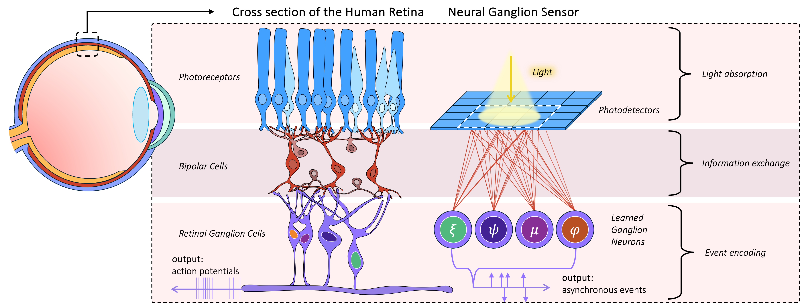

# Differentiable Event Simulator
### Neural Ganglion Sensors: Learning Task-specific Event Cameras Inspired by the Neural Circuit of the Human Retina

[Haley So](https://haleyso.github.io) and [Gordon Wetzstein](https://www.computationalimaging.org)\
[[Paper](https://haleyso.github.io/research/neural_ganglion_sensors_arxiv.pdf)]\



Abstract:
>Inspired by the data-efficient spiking mechanism of neurons in the human eye, event cameras were created to achieve high temporal resolution with minimal power and bandwidth requirements by emitting asynchronous, per-pixel intensity changes rather than conventional fixed-frame rate images. Unlike retinal ganglion cells (RGCs) in the human eye, however, which integrate signals from multiple photoreceptors within a receptive field to extract spatio-temporal features, conventional event cameras do not leverage local spatial context when deciding which events to fire. Moreover, the eye contains around 20 different kinds of RGCs operating in parallel, each attuned to different features or conditions. Inspired by this biological design, we introduce Neural Ganglion Sensors, an extension of traditional event cameras that learns task-specific spatio-temporal retinal kernels (i.e., RGC "events"). We evaluate our design on two challenging tasks: video interpolation and optical flow. Our results demonstrate that our biologically inspired sensing improves performance relative to conventional event cameras while reducing overall event bandwidth. These findings highlight the promise of RGC-inspired event sensors for edge devices and other low-power, real-time applications requiring efficient, high-resolution visual streams.


### Usage:
In this work, we learned RGCs for video interpolation and for optical flow. For video interpolation, we built off of the great work from "Event-based Frame Interpolation with Ad-hoc Deblurring" by [Lei Sun et. al](https://github.com/AHupuJR/REFID). In this repo, we show how we incorporated our differentiable event simulator. 


#### Quick Notes:
Download the dataset: [GoPro](https://seungjunnah.github.io/Datasets/gopro.html)\
Trained models: [gdrive](https://drive.google.com/drive/folders/1ZwBY1OV-_rHpdYoRiNjj4hVjfj-b-Ckk?usp=share_link)\
The differentiable event simulator can be found in: `diff_esim_torch/general_simulator.py`. 


#### Training and Evaluation Example

Training:
An example training a non-spatially varying RGC kernel in the linear domain (as opposed to log), building off of a model trained with just DVS events. 
```
CUDA_VISIBLE_DEVICES=8 python basicsr/train.py -opt  options/train/GoPro/haley/new_emulator/new_mem_update/linear_not_sv/r7lii_5e8_nosv.yml
```

Evaluation of a learned RGC, not spatially varying (PSNR 34.45 dB with avg bandwidth of 19,558.):
```
CUDA_VISIBLE_DEVICES=0 python basicsr/test_rgc.py -opt options/train/GoPro/haley/new_emulator/new_mem_update/linear_not_sv/r7lii_5e8_nosv_eval.yml
```

#### More Options
We also enable the option to learn multiple kinds of RGCs, analogous to how our eyes have multiple kinds of RGCs. Here is an example of learning 16 kinds of events. Note a few parameters will need to be changed. For ease, compare the config file above with the following (PSNR 35.16dB with avg bandwidth of 10,124 events.): 
```
CUDA_VISIBLE_DEVICES=0 python basicsr/test_rgc.py -opt options/train/GoPro/haley/new_emulator/new_mem_update/multi_coded_events/liliE16S7nosv_eval.yml
```


### Reference
If you found our work interesting or useful, please consider citing us! 

```
@inproceedings{hmso2025NeuralGanglion,
  title={Neural Ganglion Sensors: Learning Task-specific Event Cameras Inspired by the Neural Circuit of the Human Retina},
  author={Haley M. So and Gordon Wetzstein},
  booktitle={arxiv preprint arXiv:2504.13457},
  month={April},
  year={2025},
}
```
 

### Acknowledgements
We thank the authors of [REFID](https://github.com/AHupuJR/REFID) as well as [BasicSR](https://github.com/XPixelGroup/BasicSR) upon which our repository is built.


